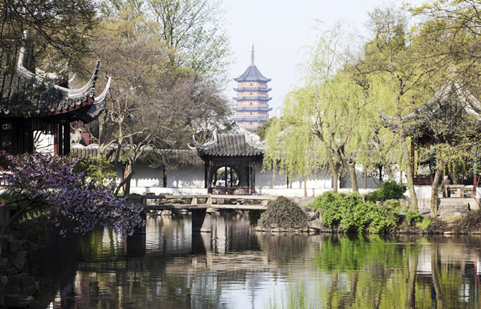
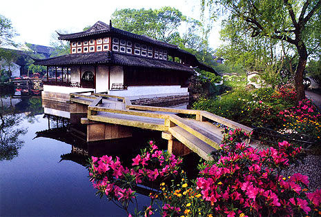
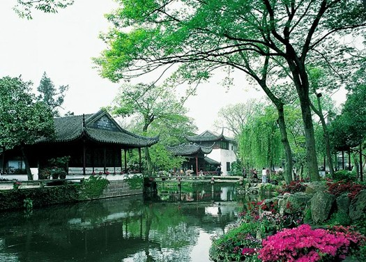

# Arhcitecture Design and Building Naming
## Humble Administrator's Garden
#### Sarah, Greta, Joseph, Kevin

For our project, we decided to focus on external architecture of the buildings in conjunction with their names. 
In The Dream of the Red Chamber, heavy emphasis is placed on building names in relation to their purpose. As we had much footage which featured the outside charachteristics of the buildings in the garden, we decided to highlight the buildings with their names to let viewers reflect on the original purpose of the buildings. We also showcased roof types of each section of the garden: East, Central, and West.
##### The Secluded Pavillion

##### Mountain-in-View Pavillion

##### The Hall of Elegant Fragrance

